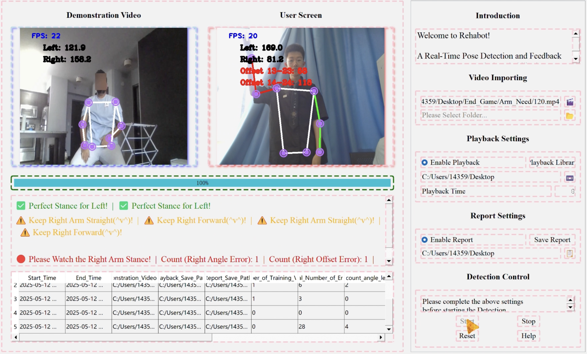

# Rehabot: 上肢康复实时姿态检测系统

### 📹 项目演示
<video width="800" controls>
  <source src="assets/demo.mp4" type="video/mp4">
</video>

> 💡 若视频无法播放，可直接在项目 `assets/` 文件夹中查看 `demo.mp4` 原文件，也参考下方主界面截图：



---

## 项目介绍
Rehabot 是一款针对上肢康复训练的实时姿态检测与反馈系统。
基于计算机视觉技术，实时对比用户动作与标准示范动作，提供即时的视觉反馈，帮助康复患者在家也能完成标准的康复训练。系统实现了算法与UI分层解耦，具备完整的数据统计、报告生成与屏幕录制能力。

## 核心功能
- ✅ 实时人体姿态检测（基于MediaPipe Pose）
- ✅ 双屏同步对比：标准示范视频 + 用户实时画面
- ✅ 动作错误实时提醒：角度偏差、位置偏移检测
- ✅ 训练数据自动统计：错误次数、动作评分
- ✅ 训练报告自动生成：CSV格式报告，支持历史记录查看
- ✅ 屏幕录制功能：自动保存训练过程视频

## 技术栈
| 模块 | 技术选型 |
|:----:|:----:|
| 核心算法 | MediaPipe Pose、OpenCV |
| UI 框架 | PyQt5 |
| 数据处理 | NumPy |
| 架构设计 | 分层模块化架构（算法层/UI层/工具层解耦） |

## 项目架构
```text
Rehabilitation/
├── Arm_Need/
├── assets/
├── core/
│   ├── __init__.py
│   └── pose_detector.py
├── ui/
│   ├── __init__.py
│   ├── main_window.py
│   └── widgets.py
├── config.py
├── main.py
├── requirements.txt
└── README.md
```

## 目录说明
|        目录         |                 功能说明                  |
|:-----------------:|:-------------------------------------:|
|     Arm_Need/     |  	静态资源目录，存放康复训练标准示范视频，程序运行时手动选择导入使用   |
|      assets/      |            	项目演示视频与主程序预览图             |
|       core/       | 	核心算法层，与 UI 解耦，专注姿态检测、关键点计算、角度校验等业务逻辑 |
|        ui/        |   UI 界面层，仅负责页面布局、视频渲染、交互事件，不包含算法逻辑    |
|    config.py	     |   全局配置文件，统一管理检测阈值、文件路径、UI 参数等，消除硬编码   |
|      main.py      |           	项目程序入口，启动整个客户端程序           |
|     README.md     |       项目说明文档，包含项目介绍、架构与快速开始指南等        |
| requirements.txt	 |            项目依赖清单，安装所需第三方库            |

## 快速开始
```bash
# 1. 克隆项目
git clone https://github.com/yourname/Rehabot.git
cd Rehabilitation

# 2. 安装项目依赖
pip install -r requirements.txt

# 3. 启动程序
python main.py
```

## 使用指引
1. 启动程序后，在 Video Importing 中选择示范视频（系统在 Arm_Need 文件夹中提供了视频，也可自行导入）；
2. 在 Playback/Report Settings 中选择是否启用录屏与报告生成功能；
3. 准备就绪后，点击 Start 即可开始实时康复训练，系统自动检测动作并给出反馈；
4. 训练结束后，点击 Stop 停止系统，录制视频、CSV 报告将自动保存至自定义目录。